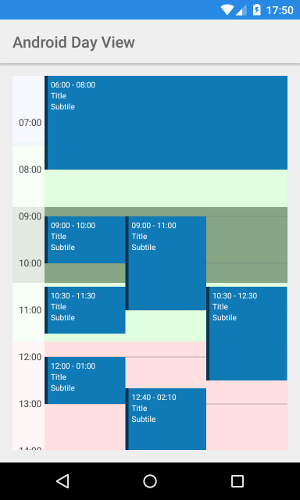
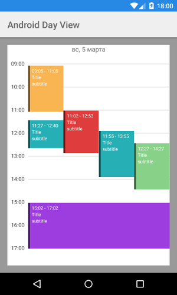

# AndroidDayView
Android custom views for present day TimeLine or DayPager




Features
------------
* Day view timeline
* Day view calendar
* Horizontal and vertical scrolling
* Infinite horizontal scrolling
* Live preview of custom styling in xml preview window
* Can set min and max hours
* Can add disabled intervals
* Can add colored intervals


Usage TimeLineView
------------------
Add TimeLineView into a layout
```xml
<?xml version="1.0" encoding="utf-8"?>
<RelativeLayout xmlns:android="http://schemas.android.com/apk/res/android"
    xmlns:tools="http://schemas.android.com/tools"
    xmlns:app="http://schemas.android.com/apk/res-auto"
    android:layout_width="match_parent"
    android:layout_height="match_parent"
    android:background="#FFF">

    <android.support.v4.widget.NestedScrollView
        android:layout_width="match_parent"
        android:layout_height="match_parent">

        <ru.fallgamlet.dayview.TimeLineView android:id="@+id/timeLineView"
            android:layout_width="match_parent"
            android:layout_height="wrap_content"
            android:background="#FFF"
            app:hourMin="6"
            app:hourMax="20"
            app:hourHeight="60dp"
            app:hourPaddingLeft="8dp"
            app:hourPaddingRight="4dp"
            app:hourLineWidth="0.5dp"
            app:hourLineColor="#777"
            app:hourBackground="#C0FFFFFF"
            app:hourTextColor="#4e4e4e"
            app:hourTextSize="12sp"
            app:disabledTimeColor="#99555555"/>

    </android.support.v4.widget.NestedScrollView>
</RelativeLayout>
```

Get *TimeLineView*
```java

TimeLineView timeLineView = (TimeLineView) findViewById(R.id.timeLineView);
```

For add events into *timeline* need create class with implement *TimeLineView.IEventHolder*. It must be holder with contain view
```java
public static class  MyEventHolder implements TimeLineView.IEventHolder {
  View rootView;
  public TimeLineView.MinuteInterval timeInterval;

  @Override
  public View getView() {
      return rootView;
  }

  @Override
  public TimeLineView.MinuteInterval getTimeInterval() {
      return timeInterval;
  }

  public MyEventHolder(Context context) {
      rootView = View.inflate(context, R.layout.layout_event, null);
  }
}
```

Add event view into *TimeLineView*
```java
MyEventHolder holder = new MyEventHolder(getContext());
holder.timeInterval = new TimeLineView.MinuteInterval(6*60, 7*60+20);
timeline.add(holder);
```
Add disabled interval into *TimeLineView*
```java
List<TimeLineView.MinuteInterval> disabledTimes = timeLineView.getDisabledTimes();
disabledTimes.add(new TimeLineView.MinuteInterval(8*HOUR+48, 10*HOUR+25));
disabledTimes.add(new TimeLineView.MinuteInterval(15*HOUR+15, 17*HOUR+5));
```

Add colored interval into *TimeLineView*
```java
int color = Color.parseColor("#200000FF");
TimeLineView.MinuteInterval interval = new TimeLineView.MinuteInterval(0, 7*HOUR+30);
timeLineView.addColoredInterval(new TimeLineView.ColoredInterval(color, interval));
```

Set listener for time selection
```java
timeLineView.setOnTimeSelectListener(new TimeLineView.IOnTimeSelectListener() {
    @Override
    public void onTimePress(Object sender, int minute) {
        String txt = String.format(Locale.getDefault(), "Selected on %02d:%02d", minute/60, minute%60);
        showSnackbar(txt);
    }

    @Override
    public void onTimeLongPressed(Object sender, int minute) {
        String txt = String.format(Locale.getDefault(), "Selected on %02d:%02d", minute/60, minute%60);
        showSnackbar(txt);
    }
});

private void showSnackbar(String msg) {
    Snackbar.make(timeLineView, msg, Snackbar.LENGTH_SHORT).show();
}
```

Usage DayViewPager
------------------

Add DayViewPager into a layout
```xml
<?xml version="1.0" encoding="utf-8"?>
<RelativeLayout xmlns:android="http://schemas.android.com/apk/res/android"
    xmlns:tools="http://schemas.android.com/tools"
    xmlns:app="http://schemas.android.com/apk/res-auto"
    android:id="@+id/activity_day_view"
    android:layout_width="match_parent"
    android:layout_height="match_parent"
    android:paddingBottom="@dimen/activity_vertical_margin"
    android:paddingLeft="@dimen/activity_horizontal_margin"
    android:paddingRight="@dimen/activity_horizontal_margin"
    android:paddingTop="@dimen/activity_vertical_margin"
    android:background="#999"
    tools:context=".DaysViewActivity">

    <ru.fallgamlet.dayview.DayViewPager android:id="@+id/dayViewPager"
        android:layout_width="match_parent"
        android:layout_height="match_parent"
        android:background="#FFF"
        app:hourHeight="50dp"
        app:hourMin="6"
        app:hourMax="22"/>

</RelativeLayout>
```

Get DayViewPager in code
```java
DayViewPager dayViewPager = (DayViewPager) findViewById(R.id.dayViewPager);
```

Set listener for DayViewPager
```java
dayViewPager.setOnContentListener(return new DayViewPager.OnContentListener() {
    @Override
    public int getMinHour(Calendar date) {
        // return min Hour for the date
        return 0;
    }

    @Override
    public int getMaxHour(Calendar date) {
        // return max Hour for the date
        return 24;
    }

    @Override
    public List<TimeLineView.IEventHolder> getEvents(Calendar date) {
        // return event holders for the date
        return null;
    }

    @Override
    public List<TimeLineView.ColoredInterval> getColoredIntervals(Calendar date) {
        // return colored intervals for the date
        return null;
    }

    @Override
    public List<TimeLineView.MinuteInterval> getDisabledIntervals(Calendar date) {
        // return disabled intervals for the date
        return null;
    }
});
```
